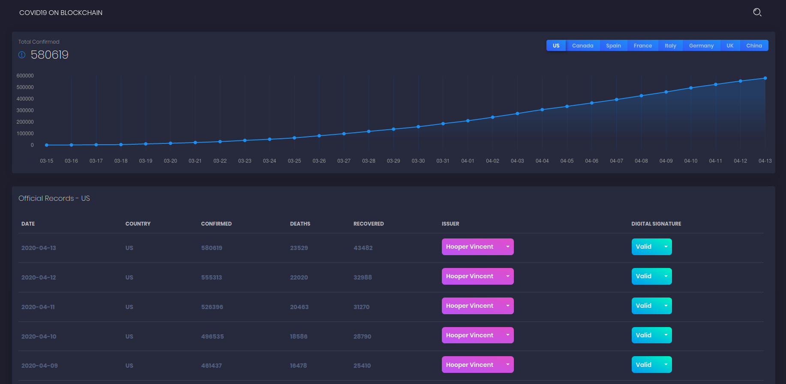

<a href="https://www.blocace.com">
	
</a>
<hr/>

__blocace-covid19__ is a COVID-19 data update dashboard based on [Black Dashboard by Creative Tim](https://github.com/creativetimofficial/black-dashboard-react) as UI (React) and [Blocace](https://www.blocace.com) as backend service (blockchain).

> Why bothering using a blockchain rather than a relational or document database as the data provider?
>
> It provides technically:
> * __immutable__ (blockchain structure and P2P consensus)
> * __verifiable__ (digital signature)
>
> data store, which intrinsically deliveries greater data accountability.

## Demo
Click the screenshot to see live demo.

[](https://www.blocace.com/covid19)

## Quick Start

Only run the UI by making REST calls to the demo Blocace at endpoint https://www.blocace.com:16899

1. Make sure you have [Node](https://nodejs.org/en/) installed
2. Clone this repo https://github.com/codingpeasant/blocace-covid19.git
3. Go to the repo directory and run `npm install`
4. Run `npm start` to start a dev server at http://localhost:3000

## Slow Start

Run both Blocace and the UI locally
1. Make sure you have [Node](https://nodejs.org/en/) installed
2. Get a copy of Blocace v0.0.6 executable for you operation system at: https://github.com/codingpeasant/blocace/releases
3. In the terminal, start a Blocace instance: `<YOU_DIR>/blocace_<OS>_amd64_v0.0.6(.exe) server` or its Windows Shell equivalent
4. Take a note of the `PRIVATE KEY` in the output
5. Open another terminal or tab ane clone this repo https://github.com/codingpeasant/blocace-covid19.git
6. Go to the repo directory and run `node ./setup/load_blocace.js <PRIVATE KEY>` or its Windows Shell equivalent to load demo COVID-19 data to Blocace (`PRIVATE KEY` is from Step 4). If you see an error `{ message: 'public key not valid' }`, switch back to the Blocace terminal/tab and delete `./data` folder and redo Step 3 to generate a new `PRIVATE KEY` to rerun this step.
7. In the same terminal, edit the 4th line of `./src/actions/index.js` by replacing `'https', 'www.blocace.com', '16899'` with `'http', 'localhost', '6899'`
8. Run `npm install`
9. Run `npm start` to start a dev server at http://localhost:3000
W
## File Structure

Within the download you'll find the following directories and files:

```
blocace-covid19
.
├── package.json
├── README.md
├── public
│   ├── index.html
│   └── manifest.json
└── src
    ├── index.js
    ├── routes.js
    ├── assets
    │   ├── css
    │   ├── demo
    │   ├── fonts
    │   ├── img
    │   └── scss
    │       ├── black-dashboard
    │       │   ├── bootstrap
    │       │   │   ├── mixins
    │       │   │   └── utilities
    │       │   ├── custom
    │       │   │   ├── cards
    │       │   │   ├── mixins
    │       │   │   ├── utilities
    │       │   │   └── vendor
    │       └── black-dashboard.scss
    ├── components
    │   ├── Footer
    │   │   └── Footer.js
    │   └── Navbars
    │       └── AdminNavbar.js
    ├── layouts
    │   └── Admin
    │       └── Admin.js
    ├── actions
    │   └── index.js
    ├── reducers
    │   ├── accountReducer.js
    │   ├── covid19Reducer.js
    │   └── index.js
    └── views
        └── Dashboard.js
```
